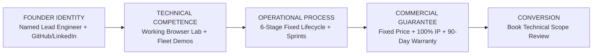

# DEVLOGIC FACE — DAY 2
## Task 2: Founder / Human Trust Architecture

**Document Type:** Design & Content Architecture Plan (Read-Only)  
**Target:** Devlogic Systems Face Hardening  
**Objective:** Establish a lean, credible, founder-led human trust layer for an early-stage engineering firm without fabricated social proof or corporate inflation.  
**Date:** August 26, 2026  

---

## PART 1 — CURRENT ABOUT SECTION ANALYSIS

### 1. What does it currently communicate?
* High-level engineering philosophy and quality commitments.
* Four core pillars: **Direct Engineer Access**, **100% IP Ownership**, **Fixed-Scope Proposals**, and **Strict TypeScript**.
* Geographic framing: "Digital engineering firm based in India with a distributed team of experienced developers."

### 2. What does it fail to communicate?
* **Zero Named Identity:** The website mentions "lead engineering team" and "senior software architects" in abstract terms, but does not name a single individual.
* **No Verifiable Professional Presence:** A prospective client cannot verify who actually operates Devlogic, inspect a founder's code repositories on GitHub, or verify their professional history on LinkedIn.

### 3. Which existing content should remain?
* **All 4 Core Standards** (`Direct Engineer Access`, `100% IP`, `Fixed-Scope Proposals`, `Strict TypeScript`) — these are concrete commercial differentiators that resonate strongly with technical buyers.
* The bottom **Technical Scope Review CTA block**.

### 4. Which content should be supplemented?
* The generic paragraph *"Devlogic Systems is a digital engineering firm based in India with a distributed team..."* should be grounded by introducing the **Founder & Principal Engineer**.

### 5. Where does a human identity layer fit naturally?
* Immediately alongside or beneath the **"Direct Engineer Access"** standard inside the existing **About Section**. This delivers on the promise of "working directly with the engineer who writes your code" by showing who that engineer is.

---

## PART 2 — MINIMUM FOUNDER PROFILE FIELD CLASSIFICATION

| Field | Classification | Rationale |
| :--- | :---: | :--- |
| **Name** | **REQUIRED** | Fundamental requirement for human accountability and contract legitimacy. |
| **Role / Title** | **REQUIRED** | Sets clear operational expectation (e.g., `Founder & Lead Systems Architect` or `Principal Engineer`). |
| **Short Bio / Focus** | **REQUIRED** | 1–2 sentences explaining what the founder builds (e.g., full-stack systems, type-safe architectures, automation). |
| **Technical Specialties** | **REQUIRED** | 3–5 core technologies (e.g., `TypeScript`, `Node.js/React`, `PostgreSQL`, `Distributed Systems`). |
| **GitHub Profile** | **REQUIRED** | The ultimate proof of technical competence for an engineering firm. |
| **LinkedIn Profile** | **REQUIRED** | Verifiable professional identity, career record, and network integrity. |
| **Email (Work Domain)** | **REQUIRED** | Direct contact pathway (`engineering@devlogicsystems.in` or `founder@devlogicsystems.in`). |
| **Location (General)** | **OPTIONAL** | Country/Region level (e.g., `India`) is sufficient for timezone alignment. |
| **Profile Photograph** | **OPTIONAL** | Authentic, professional photo adds warmth; a clean terminal avatar or professional headshot works. |
| **Personal Portfolio** | **OPTIONAL** | Useful only if it contains verified open-source work; otherwise company site is sufficient. |
| **Education Details** | **NOT RECOMMENDED** | Irrelevant for B2B software buyers; portfolio code and architectural proof carry 100x more weight. |
| **Personal Phone / Home Address**| **NOT RECOMMENDED** | Security & privacy violation. All business communications should run through email/calendar. |
| **Private Socials (IG, Personal X)**| **NOT RECOMMENDED** | Dilutes professional focus; only developer-focused public profiles belong on B2B site. |

---

## PART 3 — POSITIONING THE FOUNDER

### Comparison of Approaches:

* **Option A: "Global Enterprise Team" (Fake Inflation)**  
  * *Verdict:* **REJECTED.** Misleading, destroys trust when clients discover they are speaking with 1–2 key people.
* **Option B: "Freelancer / Solo Portfolio"**  
  * *Verdict:* **REJECTED.** Undervalues the systematic development pipelines, 90-day warranty, and enterprise infrastructure Devlogic delivers.
* **Option C: "Founder-Led Engineering Studio / Principal Engineering Practice"**  
  * *Verdict:* **RECOMMENDED (Optimal).**  
  * *Why it works:* Top clients actively prefer founder-led technical studios (like *Evil Martians, Formidable, Tighten*) because they get direct access to high-caliber senior talent without agency bloat, junior bait-and-switch, or non-technical account managers.

---

## PART 4 — VISUAL TREATMENT

### Recommended Structure: Clean Bento Profile Card in `AboutSection.tsx`

```
+-----------------------------------------------------------------------+
|  ABOUT DEVLOGIC SYSTEMS // LEADERSHIP & CRAFT                         |
|  Software Engineered with Technical Integrity.                        |
+-----------------------------------------------------------------------+
|                                                                       |
|  [ FOUNDER PROFILE CARD ]          [ 4 CORE ENGINEERING STANDARDS ]   |
|  +------------------------------+  +--------------------------------+ |
|  | [Avatar/Photo]               |  | (1) Direct Engineer Access     | |
|  | [FOUNDER NAME]               |  | (2) 100% IP & Code Ownership   | |
|  | Founder & Principal Engineer |  | (3) Fixed-Scope Proposals      | |
|  |                              |  | (4) Strict TypeScript Standard | |
|  | "Directly architecting and  |  +--------------------------------+ |
|  | delivering type-safe digital |                                     |
|  | systems for growing firms."  |                                     |
|  |                              |                                     |
|  | Stacks: TS • Node • Postgres |                                     |
|  | [GitHub] [LinkedIn] [Email]  |                                     |
|  +------------------------------+                                     |
|                                                                       |
+-----------------------------------------------------------------------+
```

* **Visual Style:** Matches the existing dark/light glass card aesthetic with slate borders and mono badges.
* **Avoidance:** No oversized hero headshots or lengthy autobiographies.

---

## PART 5 — THE CREDIBILITY CHAIN

How human identity links with Devlogic's existing proof to drive client conversion:



1. **Person:** Client sees a real, named software engineer accountable for delivery.
2. **Capability:** Client tests live browser code tools (Lab) and interactive simulators built by that engineer.
3. **Process:** Client reviews the exact 6-phase engineering lifecycle.
4. **Offer:** Client is protected by fixed pricing, source code handoff, and a 90-day warranty.
5. **Action:** Client books a consultation knowing exactly who will attend the call.

---

## PART 6 — PRIVACY & SECURITY BOUNDARIES

### Explicit Exclusions (Do NOT Publish):
* ❌ Personal mobile/phone numbers (prevents spam and off-record communication).
* ❌ Physical home/residential address (preserves personal safety).
* ❌ Personal social media accounts (Instagram, Facebook, personal WhatsApp).
* ❌ Personal government identification or academic records.

### Safe Public Surface:
* ✔ Official business email: `engineering@devlogicsystems.in`
* ✔ Professional LinkedIn profile.
* ✔ Public GitHub profile.
* ✔ Broad location: `India (UTC+5:30)`.

---

## PART 7 — PROFESSIONAL PROFILE LINKS

1. **GitHub:**
   * **Purpose:** Technical verification. Allows technical buyers and CTOs to verify coding habits, commit history, and open-source contributions.
2. **LinkedIn:**
   * **Purpose:** Business verification. Proves real identity, professional connections, and verifiable career history.
3. **Direct Business Email:**
   * **Purpose:** High-intent friction-free communication for clients who bypass web forms.

---

## PART 8 — IMPLEMENTATION LOCATION COMPARISON

| Location | Assessment | Recommendation |
| :--- | :--- | :---: |
| **Hero** | Too early. The hero must stay focused on what Devlogic solves for the client. | ❌ |
| **Featured Work** | Disrupts case study architecture flow. | ❌ |
| **About Section** | **Natural Home.** Answers *"Who is building this?"* right when the user is evaluating company standards. | **BEST (✔)** |
| **Footer** | Useful for secondary links, but lacks space for technical context. | Secondary |

---

## PART 9 — ANTI-PATTERN CHECKLIST

- [x] **NO** fake team members, stock photo employees, or placeholder staff.
- [x] **NO** fake client testimonials or invented corporate logos.
- [x] **NO** claims of "global offices across 5 continents".
- [x] **NO** inflated metrics (e.g. "500+ completed enterprise apps").
- [x] **NO** corporate jargon or AI-sounding bios ("Passionate visionary transforming synergy").

---

## FINAL OUTPUT

### A. Recommended Founder Trust Model
**Founder-Led Principal Engineering Practice:** Present Devlogic as an agile, highly specialized software engineering consultancy led directly by its founder and senior technical lead.

---

### B. Required Information Template
```markdown
Name: [FOUNDER NAME]
Role: Founder & Principal Systems Architect
Location: India (Remote Engineering Team)
Focus: Full-Stack Architecture, Type-Safe Systems, High-Reliability Business Software
Core Stack: TypeScript, React, Node.js, PostgreSQL, Redis, Cloud Run
Profiles: [GitHub Profile URL], [LinkedIn Profile URL]
Direct Contact: engineering@devlogicsystems.in
```

---

### C. Optional Information
* Professional headshot or vector terminal avatar.
* Brief 1-sentence engineering philosophy statement.

---

### D. Information to Keep Private
* Personal phone number, residential address, personal social media, private documents.

---

### E. Recommended Website Placement
* **[`src/components/AboutSection.tsx`](file:///c:/Users/prati/OneDrive/Desktop/Devlogic%20Website/src/components/AboutSection.tsx)** — integrated as a dedicated Leadership & Engineering Lead card alongside the 4 Core Guarantees.

---

### F. Visual Direction
* Single compact bento card (matching the `light-card` / dark-slate styling).
* Status indicator: `🟢 AVAILABLE FOR Q3/Q4 TECHNICAL SCOPES`.
* Badges for key technologies: `TypeScript`, `Node.js`, `PostgreSQL`.
* Clean icon-button links for GitHub, LinkedIn, and Email.

---

### G. Content Structure Template
```tsx
// Content Blueprint for AboutSection Profile Block
const FOUNDER_PROFILE = {
  name: "[FOUNDER NAME]",
  role: "Founder & Lead Systems Architect",
  location: "India · UTC+5:30",
  bio: "Architects and implements high-reliability web applications, custom ERPs, and automation systems for growing companies with strict type safety and fixed deliverables.",
  specialties: ["TypeScript", "Node.js / React", "PostgreSQL & Redis", "Cloud Infrastructure"],
  availability: "Accepting New Projects",
  links: {
    github: "[GITHUB_URL]",
    linkedin: "[LINKEDIN_URL]",
    email: "engineering@devlogicsystems.in"
  }
};
```

---

### H. Credibility Chain Summary
Grounded human identity turns Devlogic's existing technical demonstrations (Fleet ERP preview, Project Estimator, Devlogic Lab) from *"cool frontend widgets"* into *"proof of the lead architect's personal software engineering standards"*.

---

### I. Implementation Scope
* **Minimal & Low-Risk:** Requires editing only `src/data/companyData.ts` (to add the structured profile fields) and modifying the layout in `src/components/AboutSection.tsx` to render the profile card alongside the guarantees.

---

### J. What NOT to Change
* **Do NOT modify:** `Hero.tsx`, `ServicesSection.tsx`, `SolutionsSection.tsx`, `ProcessSection.tsx`, `FeaturedWorkSection.tsx`, `ProjectEstimatorModal.tsx`, or `ContactSection.tsx`.
