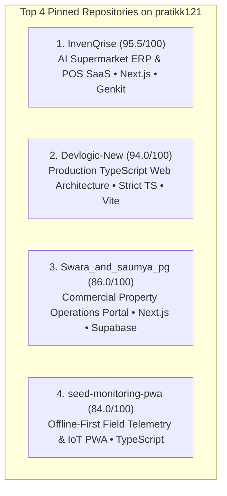

# Task 6 — GitHub Portfolio Consolidation & Technical Identity

**Primary Account Target:** `https://github.com/pratikk121` (Personal Technical Identity Handle)  
**Source Repositories:** `https://github.com/novaninja1512-sketch` & `https://github.com/invenqrise-creator`  
**Audit Type:** Technical Identity, Repository Security, Portfolio Curation & Consolidation  
**Auditor Perspective:** CTO / Technical Lead / Enterprise Buyer Evaluator  
**Status:** **IN PROGRESS (Task 6.8 Approved & Ready for Profile Repository Creation)**  
**Date:** August 26, 2026  

---

## 1. Objective
The objective of Task 6 is to consolidate the founder's (**Pratik Kadole**) public GitHub presence into a single, highly credible, professional identity (**`pratikk121`**), ensuring:
1. All public repositories are secure, properly curated, and free of sensitive customer/tenant data.
2. The portfolio acts as an evidence-based technical proof layer for Devlogic Systems (`https://devlogicsystems.in`).
3. Projects are categorized into clear tiers (Flagship, Supporting, Academic Archive, Profile README).

---

## 2. Current Status
* **Completed (100%):**
  * Primary technical identity selected (`pratikk121`).
  * 8-repository security and privacy audit completed (0 leaks, 0 exposed secrets).
  * Data privacy verification for `Swara_and_saumya_pg` completed (**Safe Mock / Green Gate**).
  * Migration preflight audit completed for Vercel, local git remotes, and repository dependencies.
  * Clean separation of Task 6 (GitHub) and Task 7 (InvenQrise v2) completed.
  * **Phase 1 Migration Executed & Verified:** `seed-monitoring-pwa` and `kr-photography` live on `pratikk121`.
  * **Phase 2 Migration Executed & Verified:** `Swara_and_saumya_pg` and `InvenQrise` live on `pratikk121`.
  * **Phase 3 Migration Executed & Verified:** `Devlogic-New` live on `pratikk121` + local remote origin updated.
  * **Task 6.8 & 6.8A Editorial Specifications:** Approved with adjustments.
* **In Execution:**
  * Creating/Updating `pratikk121/pratikk121` profile README on GitHub.

---

## 3. Primary GitHub Identity Decision
* **Primary Account:** `https://github.com/pratikk121`
  * Matches verified founder name (**Pratik Kadole**), LinkedIn profile, and business documents.
* **Relationship with Secondary Accounts:**
  * `novaninja1512-sketch`: Source account holding legacy Devlogic project repositories; now successfully transferred to `pratikk121`.
  * `invenqrise-creator`: Project-specific repository handle; InvenQrise successfully transferred to `pratikk121`.

---

## 4. Repository Consolidation Matrix (All 5 Target Repositories Transferred)

| Repository | Current Account | Ownership | Security / Privacy | Portfolio Tier | Migration Status | Deployment Dependency |
| :--- | :--- | :---: | :---: | :---: | :---: | :--- |
| **`Devlogic-New`** | **`pratikk121`** | Devlogic Systems | **CLEAR** | **Flagship (A)** | ✅ **MIGRATED & VERIFIED** | Vercel Edge (`devlogicsystems.in`) |
| **`InvenQrise`** | **`pratikk121`** | Founder / Devlogic | **CLEAR** | **Flagship (A+)**| ✅ **MIGRATED & VERIFIED** | Vercel Demo (Decoupled) |
| **`Swara_and_saumya_pg`** | **`pratikk121`** | Founder / Devlogic | **CLEAR** | **Flagship (A)** | ✅ **MIGRATED & VERIFIED** | Vercel Demo (Decoupled) |
| **`seed-monitoring-pwa`** | **`pratikk121`** | Founder | **CLEAR** | **Flagship (A)** | ✅ **MIGRATED & VERIFIED** | None (Standalone PWA) |
| **`kr-photography`** | **`pratikk121`** | Founder | **CLEAR** | **Supporting (B)**| ✅ **MIGRATED & VERIFIED** | None (Static Frontend) |
| **`CRM`** | `pratikk121` | Founder / Devlogic | **CLEAR** | **Supporting (A-)**| Preserved on Primary | None |
| **`Web-Expence-Tracker...`**| `pratikk121` | Academic / Student | **CLEAR** | **Archive (D)** | Archive / Unpin | None |
| **`online_voting...`** | `pratikk121` | Academic / Student | **CLEAR** | **Archive (D)** | Archive / Unpin | None |
| **`pratikk`** | `pratikk121` | Founder Profile | **CLEAR** | **Profile (C)** | Convert to `pratikk121` | None (Profile README) |

---

## 5. Portfolio Curation & Pinned Selection



---

## 6. 3-Phase Migration Execution Summary (ALL PHASES COMPLETE)

```
PHASE 1: Zero-Risk Standalone Transfer [COMPLETED & VERIFIED]
✅ 1. Transfer `seed-monitoring-pwa` (novaninja1512-sketch -> pratikk121)
✅ 2. Transfer `kr-photography` (novaninja1512-sketch -> pratikk121)

PHASE 2: Project Repositories [COMPLETED & VERIFIED]
✅ 3. Transfer `Swara_and_saumya_pg` (novaninja1512-sketch -> pratikk121)
✅ 4. Transfer `InvenQrise` (invenqrise-creator -> pratikk121)

PHASE 3: Flagship Production Transfer [COMPLETED & VERIFIED]
✅ 5. Transfer `Devlogic-New` (novaninja1512-sketch -> pratikk121)
✅ 6. Updated local git remote: git remote set-url origin https://github.com/pratikk121/Devlogic-New.git
```

---

## 7. Task 7 Cross-Reference
> **Important Note:**  
> During Task 6, **InvenQrise** was identified as a major independent engineering and commercial product initiative. All InvenQrise-specific domain architecture, PostgreSQL database design, Firebase-to-Supabase migration analysis, POS workflow specifications, and v2 rebuild roadmaps have been officially moved to **Task 7**.
> 
> 👉 See: **[`reports/DAY 2/TASK_7_INVENQRISE_V2_HANDOFF.md`](file:///c:/Users/prati/OneDrive/Desktop/Devlogic%20Website/reports/DAY%202/TASK_7_INVENQRISE_V2_HANDOFF.md)**

---

## 8. Migration Verification Summary (Phases 1, 2 & 3 — 100% COMPLETE)

| Repository | Initial Owner | Final Destination URL | Redirect | Verification Status |
| :--- | :--- | :--- | :---: | :---: |
| **`seed-monitoring-pwa`** | `novaninja1512-sketch` | [`github.com/pratikk121/seed-monitoring-pwa`](https://github.com/pratikk121/seed-monitoring-pwa) | ✅ HTTP 301 Active | **VERIFIED (200 OK)** |
| **`kr-photography`** | `novaninja1512-sketch` | [`github.com/pratikk121/kr-photography`](https://github.com/pratikk121/kr-photography) | ✅ HTTP 301 Active | **VERIFIED (200 OK)** |
| **`Swara_and_saumya_pg`** | `novaninja1512-sketch` | [`github.com/pratikk121/Swara_and_saumya_pg`](https://github.com/pratikk121/Swara_and_saumya_pg) | ✅ HTTP 301 Active | **VERIFIED (200 OK)** |
| **`InvenQrise`** | `invenqrise-creator` | [`github.com/pratikk121/InvenQrise`](https://github.com/pratikk121/InvenQrise) | ✅ HTTP 301 Active | **VERIFIED (200 OK)** |
| **`Devlogic-New`** | `novaninja1512-sketch` | [`github.com/pratikk121/Devlogic-New`](https://github.com/pratikk121/Devlogic-New) | ✅ HTTP 301 Active | **VERIFIED (200 OK)** |

---

## 9. Task 6.8: Approved GitHub Profile README (`pratikk121/pratikk121`)

### Final Approved Markdown Specification:

```markdown
# Pratik Kadole

**Founder & CEO — [Devlogic Systems](https://devlogicsystems.in)**  
*Building web applications, business software systems, and data-driven digital tools.*

[Website](https://devlogicsystems.in) • [LinkedIn](https://www.linkedin.com/in/pratik-kadole-119391267/) • [Email](mailto:devlogicsystems@gmail.com)

---

## ⚡ What I Build

I design and build software products and systems with a focus on practical architecture, clean code, and rapid execution. I use modern AI-assisted development tools as a force multiplier to move quickly from concept to working software while directing the underlying architecture, data models, and system logic.

* **Web Applications & Tools:** Responsive applications built with TypeScript, React, and Next.js.
* **Business Portals & ERPs:** Property operations systems, inventory management, and operational workflows.
* **Offline-First Software:** Progressive Web Apps (PWAs) with local caching and real-time telemetry dashboards.

---

## 🛠️ Core Technologies

* **Languages:** TypeScript, JavaScript, SQL, HTML5, CSS3
* **Frontend:** Next.js (App Router), React, Tailwind CSS, Vite
* **Backend & Data:** Supabase (PostgreSQL), Firebase, Node.js
* **Tooling & Architecture:** Progressive Web Apps (PWA), REST APIs, Git, Google GenAI / Genkit

---

## 🚀 Selected Projects

### [InvenQrise](https://github.com/pratikk121/InvenQrise)
> **Retail Inventory & Point-of-Sale System**  
> Store management application featuring camera-based barcode scanning, POS checkout workflows, and AI-assisted stock forecasting.  
> *Stack: Next.js 15, Google Genkit, Firebase (v1) • v2 redesign planned for Supabase PostgreSQL.*

### [Devlogic Systems — Business Website & Interactive Scope Engine](https://github.com/pratikk121/Devlogic-New)
> **Production Web Architecture & Interactive Scope Engine**  
> The official web presence for Devlogic Systems, built with strict TypeScript, a custom CSS design system, and dynamic cost estimation models.  
> *Stack: TypeScript, Vite, Vanilla CSS.*

### [Swara & Saumya PG Portal](https://github.com/pratikk121/Swara_and_saumya_pg)
> **Property Operations & Billing Platform**  
> Commercial portal designed for tenant lifecycle management, room allocations, fee tracking, and payment verification.  
> *Stack: Next.js, Supabase, Tailwind CSS.*

### [Seed Monitoring PWA](https://github.com/pratikk121/seed-monitoring-pwa)
> **Offline-First Field Telemetry Dashboard**  
> Progressive Web App built for field sensor data collection, operating offline with client-side caching and responsive charts.  
> *Stack: TypeScript, PWA Service Worker, Chart.js.*

---

## 🏢 About Devlogic Systems

[Devlogic Systems](https://devlogicsystems.in) is an independent software development and systems engineering practice founded by Pratik Kadole. We design, build, and deploy reliable web applications, internal tools, and automation systems for businesses.

* 🌐 **Website:** [https://devlogicsystems.in](https://devlogicsystems.in)
* 📬 **Contact:** [devlogicsystems@gmail.com](mailto:devlogicsystems@gmail.com)
```

---

## 10. Task 6.8 Implementation Steps

To activate this profile README on GitHub:
1. Ensure the repository named **`pratikk121/pratikk121`** is created and Public on GitHub:
   * URL: [`https://github.com/pratikk121/pratikk121`](https://github.com/pratikk121/pratikk121)
   *(If you previously had `pratikk121/pratikk`, simply rename it to `pratikk121` in its Settings $\rightarrow$ General $\rightarrow$ Repository Name).*
2. Paste the approved markdown into its `README.md` and commit.
3. Verify the rendered profile at [`https://github.com/pratikk121`](https://github.com/pratikk121).
