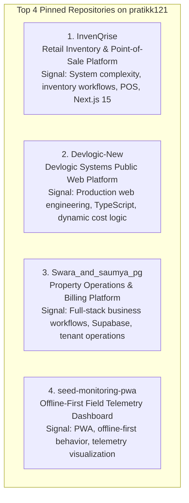

# Task 6 — GitHub Portfolio Consolidation & Technical Identity

**Primary Account Target:** `https://github.com/pratikk121` (Personal Technical Identity Handle)  
**Source Repositories:** `https://github.com/novaninja1512-sketch` & `https://github.com/invenqrise-creator`  
**Audit Type:** Technical Identity, Repository Security, Portfolio Curation & Consolidation  
**Auditor Perspective:** CTO / Technical Lead / Enterprise Buyer Evaluator  
**Status:** **IN REVIEW (Task 6.9A Final Editorial Corrections Applied — Implementation Ready)**  
**Date:** August 26, 2026  

---

## 1. Objective
The objective of Task 6 is to consolidate the founder's (**Pratik Kadole**) public GitHub presence into a single, highly credible, professional identity (**`pratikk121`**), ensuring:
1. All public repositories are secure, properly curated, and free of sensitive customer/tenant data.
2. The portfolio acts as an evidence-based technical proof layer for Devlogic Systems (`https://devlogicsystems.in`).
3. Projects are categorized into clear tiers (Flagship, Supporting, Academic Archive, Profile README).

---

## 2. Current Status
* **Completed (100%):**
  * Primary technical identity selected (`pratikk121`).
  * 8-repository security and privacy audit completed (0 leaks, 0 exposed secrets).
  * Data privacy verification for `Swara_and_saumya_pg` completed (**Safe Mock / Green Gate**).
  * Migration preflight audit completed for Vercel, local git remotes, and repository dependencies.
  * Clean separation of Task 6 (GitHub) and Task 7 (InvenQrise v2) completed.
  * **Phase 1 Migration Executed & Verified:** `seed-monitoring-pwa` and `kr-photography` live on `pratikk121`.
  * **Phase 2 Migration Executed & Verified:** `Swara_and_saumya_pg` and `InvenQrise` live on `pratikk121`.
  * **Phase 3 Migration Executed & Verified:** `Devlogic-New` live on `pratikk121` + local remote origin updated.
  * **Task 6.8 Profile README Executed & Verified:** `pratikk121/pratikk121` live and rendering on profile.
* **In Review (Task 6.9A):**
  * Final Editorial Corrections Applied. Positioning is factually precise, free of premature SaaS claims, and ready for execution.

---

## 3. Primary GitHub Identity Decision
* **Primary Account:** `https://github.com/pratikk121`
  * Matches verified founder name (**Pratik Kadole**), LinkedIn profile, and business documents.
* **Relationship with Secondary Accounts:**
  * `novaninja1512-sketch`: Source account holding legacy Devlogic project repositories; now successfully transferred to `pratikk121`.
  * `invenqrise-creator`: Project-specific repository handle; InvenQrise successfully transferred to `pratikk121`.

---

## 4. Repository Consolidation Matrix (All 5 Target Repositories Transferred)

| Repository | Current Account | Ownership | Security / Privacy | Portfolio Tier | Migration Status | Deployment Dependency |
| :--- | :--- | :---: | :---: | :---: | :---: | :--- |
| **`Devlogic-New`** | **`pratikk121`** | Devlogic Systems | **CLEAR** | **Flagship (A)** | ✅ **MIGRATED & VERIFIED** | Vercel Edge (`devlogicsystems.in`) |
| **`InvenQrise`** | **`pratikk121`** | Founder / Devlogic | **CLEAR** | **Flagship (A+)**| ✅ **MIGRATED & VERIFIED** | Vercel Demo (Decoupled) |
| **`Swara_and_saumya_pg`** | **`pratikk121`** | Founder / Devlogic | **CLEAR** | **Flagship (A)** | ✅ **MIGRATED & VERIFIED** | Vercel Demo (Decoupled) |
| **`seed-monitoring-pwa`** | **`pratikk121`** | Founder | **CLEAR** | **Flagship (A)** | ✅ **MIGRATED & VERIFIED** | None (Standalone PWA) |
| **`kr-photography`** | **`pratikk121`** | Founder | **CLEAR** | **Supporting (B)**| ✅ **MIGRATED & VERIFIED** | None (Static Frontend) |
| **`CRM`** | `pratikk121` | Founder / Devlogic | **CLEAR** | **Supporting (A-)**| Preserved on Primary | None |
| **`Web-Expence-Tracker...`**| `pratikk121` | Academic / Student | **CLEAR** | **Archive (D)** | Archive / Unpin | None |
| **`online_voting...`** | `pratikk121` | Academic / Student | **CLEAR** | **Archive (D)** | Archive / Unpin | None |
| **`pratikk121`** | **`pratikk121`** | Founder Profile | **CLEAR** | **Profile (Special)**| ✅ **LIVE & VERIFIED** | GitHub Profile README |

---

## 5. Task 6.9A: Portfolio Presentation & Repository Polish Audit (Refined)

### 1. Portfolio Presentation Audit

| Repository | Current Public Role | Public Impression | Strength | Weakness & Boundary | Recommended Action |
| :--- | :--- | :--- | :--- | :--- | :--- |
| **`InvenQrise`** | Retail Inventory & Point-of-Sale Platform | High technical complexity; complete grocery management workflow. | Full POS flow, camera barcode scanner, clean Next.js 15 App Router. | v1 is a completed capstone MVP using Firebase; v2 PostgreSQL is planned. | **Pin as #1 Flagship.** Update description to reflect retail POS/inventory; add exact topics. |
| **`Devlogic-New`** | Devlogic Systems Public Web Platform | Production-facing web presence; high engineering discipline. | Strict TypeScript, custom dynamic cost estimation models, clean CSS. | Missing root `README.md`. | **Pin as #2 Flagship.** Add professional `README.md`; move scratch prompts to `prompts/`. |
| **`Swara_and_saumya_pg`** | Property Operations & Billing Platform | Real-world commercial workflow utility. | Full-stack Supabase integration, role-based permissions, tenant ledger. | Straightforward UI design. | **Pin as #3 Flagship.** Add clear repository description & Supabase/Next.js topics. |
| **`seed-monitoring-pwa`** | Offline-First Field Telemetry Dashboard | Authentic hardware telemetry and edge data collection. | Offline Service Worker caching, responsive sensor charts. | Narrow domain focus. | **Pin as #4 Flagship.** Add PWA/telemetry topics; keep pinned as hardware proof point. |
| **`CRM`** | Commercial Pipeline Prototype | Lead and sales pipeline prototype. | Full client/lead database structure. | Unfinished UI polish. | **Keep active, unpinned.** Add description indicating prototype status. |
| **`kr-photography`** | Responsive Photography Showcase | Visual portfolio frontend. | Clean static responsive image grid. | Static frontend without backend state. | **Keep active, unpinned.** Add description as responsive portfolio frontend. |
| **`Web-Expence-Tracker...`**| Academic Archive | Student project. | Demonstrates baseline programming progression. | Outdated patterns. | **Unpinned / Archive status.** Do not feature on profile overview. |
| **`online_voting...`** | Academic Archive | Student project. | Historical academic work. | Generic student assignment feel. | **Unpinned / Archive status.** Do not feature on profile overview. |

---

### 2. Recommended Pinned Portfolio (The Top 4 Flagships)



| Rank | Repository | Main Evaluator Signal | Why It Belongs |
| :---: | :--- | :--- | :--- |
| **1** | **`InvenQrise`** | **Product/System Complexity:** Inventory workflows, POS, barcode scanning, Next.js 15. | Flagship product engineering project. Demonstrates complex domain modeling. |
| **2** | **`Devlogic-New`** | **Production Web Engineering:** Strict TypeScript, interactive business logic, UI engineering. | Official public web platform and engineering standard for Devlogic Systems. |
| **3** | **`Swara_and_saumya_pg`** | **Full-Stack Business Workflows:** Supabase/PostgreSQL, commercial property & tenant operations. | Proves ability to design and deliver relational database platforms for real operations. |
| **4** | **`seed-monitoring-pwa`** | **Offline & Telemetry Capabilities:** PWA Service Workers, sensor data visualization. | Hardware-oriented edge system. Demonstrates technical breadth beyond typical CRUD. |

---

### 3. Factual Repository Descriptions (Zero Fluff / Zero Premature Claims)

| Repository | Current Description | Proposed Description (Factual & Precise) | Reason |
| :--- | :--- | :--- | :--- |
| **`InvenQrise`** | *None* | `Retail inventory and Point-of-Sale platform built with Next.js and Firebase, with a v2 modernization planned around Supabase/PostgreSQL.` | Factual; highlights actual v1 architecture while transparently noting v2 planning. |
| **`Devlogic-New`** | `web new` | `Official business website and interactive scope estimation engine for Devlogic Systems.` | Replaces generic placeholder with exact business role. |
| **`Swara_and_saumya_pg`** | *None* | `Commercial property operations and tenant billing management portal built with Next.js and Supabase.` | Communicates domain and actual full-stack backend technology. |
| **`seed-monitoring-pwa`** | *None* | `Offline-first field telemetry and sensor data collection Progressive Web App (PWA) with real-time charts.` | Highlights offline resilience and edge data visualization. |
| **`CRM`** | *None* | `Commercial CRM and customer pipeline management prototype built with TypeScript.` | Clarifies prototype scope. |
| **`kr-photography`** | *None* | `Responsive photography showcase and portfolio web application.` | Factual description of static frontend. |

---

### 4. Proposed GitHub Topics (4–8 Meaningful Tags Per Repo)

| Repository | Proposed Topics | Reason |
| :--- | :--- | :--- |
| **`InvenQrise`** | `nextjs`, `typescript`, `pos-system`, `inventory-management`, `barcode-scanner`, `firebase` | Concrete stack and domain terms. |
| **`Devlogic-New`** | `typescript`, `vite`, `css3`, `web-development`, `cost-estimator`, `devlogic-systems` | Accurate frontend and branding tags. |
| **`Swara_and_saumya_pg`** | `nextjs`, `supabase`, `postgresql`, `property-management`, `tenant-portal`, `tailwindcss` | Clear data and commercial workflow tags. |
| **`seed-monitoring-pwa`** | `pwa`, `service-worker`, `offline-first`, `telemetry`, `chartjs`, `typescript`, `iot` | Highlights IoT and offline capabilities. |

---

### 5. Devlogic-New Documentation Cleanup Plan

```
Devlogic-New/
├── docs/                        # Durable Architectural Knowledge
│   └── ARCHITECTURE.md          # Web tokens, interactive scope engine, and telemetry canvas
│
├── prompts/                     # Reusable AI & Design Prompts (Moved from root)
│   ├── dark_mode_prompts.md     # Scratch dark mode prompt instructions
│   └── redesign_prompts.md      # Scratch component redesign prompts
│
├── reports/                     # Time-Stamped Historical Evidence & Audits
│   ├── DAY 1/                   # Day 1 SEO & Production Audits
│   ├── DAY 2/                   # Day 2 Trust Layer, GitHub Consolidation, Task 7 Handoff
│   ├── future/                  # Future roadmaps and strategic plans
│   └── DEVLOGIC_NEW_REPOSITORY_STRUCTURE_ARCHITECTURE_AUDIT.md
│
└── README.md                    # Professional root documentation for Devlogic-New
```

#### File Move Plan:
1. `dark_mode_prompts.md` $\rightarrow$ `prompts/dark_mode_prompts.md`
2. `redesign_prompts.md` $\rightarrow$ `prompts/redesign_prompts.md`
3. `lighthouse-report.json`: Already in `.gitignore` (`lighthouse-report*.json`). Retained locally as historical test output without tracking in git.

---

### 6. Public Narrative Consistency Verification

| Narrative Pillar | Portfolio Presentation Status | Verification Verdict |
| :--- | :--- | :---: |
| **"Builder of software products and systems"** | 4 pinned projects showcase a retail POS platform (`InvenQrise`), an operational portal (`Swara_PG`), a telemetry PWA (`Seed_PWA`), and a production web platform (`Devlogic-New`). | ✅ **100% Truthful** |
| **"AI as an engineering force multiplier"** | Highlighted as an execution tool for rapid architecture-to-code, without claiming unverified AI SaaS models. | ✅ **100% Truthful** |
| **"Zero Premature SaaS Claims"** | InvenQrise is positioned strictly as an *Inventory & Point-of-Sale Platform* (v1 completed MVP; v2 in design). | ✅ **100% Truthful** |
| **"Accurate Stacks"** | Next.js, TypeScript, Supabase, Firebase, and PWAs match repository source codes exactly. | ✅ **100% Truthful** |

---

### 7. Implementation Plan (Ready for Approval)

1. **Step 1: Clean Local `Devlogic-New` Repository Structure:**
   * Create `prompts/` directory and move `dark_mode_prompts.md` & `redesign_prompts.md` into it.
   * Add professional `README.md` to `Devlogic-New` root.
   * Commit and push changes to `pratikk121/Devlogic-New`.
2. **Step 2: Update Repository Descriptions & Topics on GitHub:**
   * Apply factual descriptions and topic tags to `Devlogic-New`, `InvenQrise`, `Swara_and_saumya_pg`, and `seed-monitoring-pwa`.
3. **Step 3: Pin Top 4 Repositories on GitHub Profile Overview:**
   * Pin `InvenQrise`, `Devlogic-New`, `Swara_and_saumya_pg`, and `seed-monitoring-pwa` on `https://github.com/pratikk121`.
