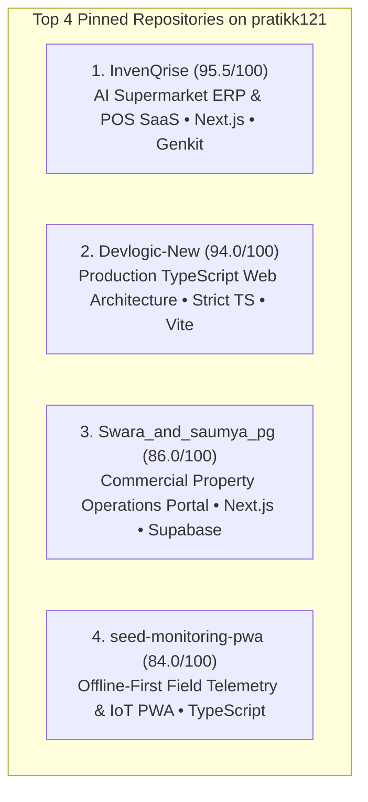

# Task 6 — GitHub Portfolio Consolidation & Technical Identity

**Primary Account Target:** `https://github.com/pratikk121` (Personal Technical Identity Handle)  
**Source Repositories:** `https://github.com/novaninja1512-sketch` & `https://github.com/invenqrise-creator`  
**Audit Type:** Technical Identity, Repository Security, Portfolio Curation & Consolidation  
**Auditor Perspective:** CTO / Technical Lead / Enterprise Buyer Evaluator  
**Status:** **PHASE 1, 2 & 3 MIGRATIONS COMPLETE (100% Transferred to `pratikk121`)**  
**Date:** August 26, 2026  

---

## 1. Objective
The objective of Task 6 is to consolidate the founder's (**Pratik Kadole**) public GitHub presence into a single, highly credible, professional identity (**`pratikk121`**), ensuring:
1. All public repositories are secure, properly curated, and free of sensitive customer/tenant data.
2. The portfolio acts as an evidence-based technical proof layer for Devlogic Systems (`https://devlogicsystems.in`).
3. Projects are categorized into clear tiers (Flagship, Supporting, Academic Archive, Profile README).

---

## 2. Current Status
* **Completed (100%):**
  * Primary technical identity selected (`pratikk121`).
  * 8-repository security and privacy audit completed (0 leaks, 0 exposed secrets).
  * Data privacy verification for `Swara_and_saumya_pg` completed (**Safe Mock / Green Gate**).
  * Migration preflight audit completed for Vercel, local git remotes, and repository dependencies.
  * Clean separation of Task 6 (GitHub) and Task 7 (InvenQrise v2) completed.
  * **Phase 1 Migration Executed & Verified:** `seed-monitoring-pwa` and `kr-photography` live on `pratikk121`.
  * **Phase 2 Migration Executed & Verified:** `Swara_and_saumya_pg` and `InvenQrise` live on `pratikk121`.
  * **Phase 3 Migration Executed & Verified:** `Devlogic-New` live on `pratikk121` + local remote origin updated.
* **Next in Queue:**
  * Profile README deployment (`pratikk121/pratikk121`) and repository pinning.

---

## 3. Primary GitHub Identity Decision
* **Primary Account:** `https://github.com/pratikk121`
  * Matches verified founder name (**Pratik Kadole**), LinkedIn profile, and business documents.
* **Relationship with Secondary Accounts:**
  * `novaninja1512-sketch`: Source account holding legacy Devlogic project repositories; now successfully transferred to `pratikk121`.
  * `invenqrise-creator`: Project-specific repository handle; InvenQrise successfully transferred to `pratikk121`.

---

## 4. Repository Consolidation Matrix (All 5 Target Repositories Transferred)

| Repository | Current Account | Ownership | Security / Privacy | Portfolio Tier | Migration Status | Deployment Dependency |
| :--- | :--- | :---: | :---: | :---: | :---: | :--- |
| **`Devlogic-New`** | **`pratikk121`** | Devlogic Systems | **CLEAR** | **Flagship (A)** | ✅ **MIGRATED & VERIFIED** | Vercel Edge (`devlogicsystems.in`) |
| **`InvenQrise`** | **`pratikk121`** | Founder / Devlogic | **CLEAR** | **Flagship (A+)**| ✅ **MIGRATED & VERIFIED** | Vercel Demo (Decoupled) |
| **`Swara_and_saumya_pg`** | **`pratikk121`** | Founder / Devlogic | **CLEAR** | **Flagship (A)** | ✅ **MIGRATED & VERIFIED** | Vercel Demo (Decoupled) |
| **`seed-monitoring-pwa`** | **`pratikk121`** | Founder | **CLEAR** | **Flagship (A)** | ✅ **MIGRATED & VERIFIED** | None (Standalone PWA) |
| **`kr-photography`** | **`pratikk121`** | Founder | **CLEAR** | **Supporting (B)**| ✅ **MIGRATED & VERIFIED** | None (Static Frontend) |
| **`CRM`** | `pratikk121` | Founder / Devlogic | **CLEAR** | **Supporting (A-)**| Preserved on Primary | None |
| **`Web-Expence-Tracker...`**| `pratikk121` | Academic / Student | **CLEAR** | **Archive (D)** | Archive / Unpin | None |
| **`online_voting...`** | `pratikk121` | Academic / Student | **CLEAR** | **Archive (D)** | Archive / Unpin | None |
| **`pratikk`** | `pratikk121` | Founder Profile | **CLEAR** | **Profile (C)** | Convert to `pratikk121` | None (Profile README) |

---

## 5. Portfolio Curation & Pinned Selection



---

## 6. 3-Phase Migration Execution Summary (ALL PHASES COMPLETE)

```
PHASE 1: Zero-Risk Standalone Transfer [COMPLETED & VERIFIED]
✅ 1. Transfer `seed-monitoring-pwa` (novaninja1512-sketch -> pratikk121)
✅ 2. Transfer `kr-photography` (novaninja1512-sketch -> pratikk121)

PHASE 2: Project Repositories [COMPLETED & VERIFIED]
✅ 3. Transfer `Swara_and_saumya_pg` (novaninja1512-sketch -> pratikk121)
✅ 4. Transfer `InvenQrise` (invenqrise-creator -> pratikk121)

PHASE 3: Flagship Production Transfer [COMPLETED & VERIFIED]
✅ 5. Transfer `Devlogic-New` (novaninja1512-sketch -> pratikk121)
✅ 6. Updated local git remote: git remote set-url origin https://github.com/pratikk121/Devlogic-New.git
```

---

## 7. Task 7 Cross-Reference
> **Important Note:**  
> During Task 6, **InvenQrise** was identified as a major independent engineering and commercial product initiative. All InvenQrise-specific domain architecture, PostgreSQL database design, Firebase-to-Supabase migration analysis, POS workflow specifications, and v2 rebuild roadmaps have been officially moved to **Task 7**.
> 
> 👉 See: **[`reports/DAY 2/TASK_7_INVENQRISE_V2_HANDOFF.md`](file:///c:/Users/prati/OneDrive/Desktop/Devlogic%20Website/reports/DAY%202/TASK_7_INVENQRISE_V2_HANDOFF.md)**

---

## 8. Phase 1 & Phase 2 Migration Verification Summary (COMPLETE)

| Repository | Initial Owner | Final Destination URL | Redirect | Verification Status |
| :--- | :--- | :--- | :---: | :---: |
| **`seed-monitoring-pwa`** | `novaninja1512-sketch` | [`github.com/pratikk121/seed-monitoring-pwa`](https://github.com/pratikk121/seed-monitoring-pwa) | ✅ HTTP 301 Active | **VERIFIED (200 OK)** |
| **`kr-photography`** | `novaninja1512-sketch` | [`github.com/pratikk121/kr-photography`](https://github.com/pratikk121/kr-photography) | ✅ HTTP 301 Active | **VERIFIED (200 OK)** |
| **`Swara_and_saumya_pg`** | `novaninja1512-sketch` | [`github.com/pratikk121/Swara_and_saumya_pg`](https://github.com/pratikk121/Swara_and_saumya_pg) | ✅ HTTP 301 Active | **VERIFIED (200 OK)** |
| **`InvenQrise`** | `invenqrise-creator` | [`github.com/pratikk121/InvenQrise`](https://github.com/pratikk121/InvenQrise) | ✅ HTTP 301 Active | **VERIFIED (200 OK)** |

---

## 9. Phase 3 Flagship Verification Report (Task 6.7 — COMPLETE)

### Pre-Transfer Snapshot

| Property | Value |
| :--- | :--- |
| **Source Owner** | `novaninja1512-sketch` |
| **Target Owner** | `pratikk121` |
| **Visibility** | Public |
| **Default Branch** | `main` |
| **Latest Commit SHA** | `be1e49525ae585fdf9d878bd6c2640a92d468a4d` |
| **Branch Count** | 1 (`main`) |

---

### Transfer Result

| Property | Result |
| :--- | :--- |
| **New Owner** | **`pratikk121`** |
| **Destination URL** | [`https://github.com/pratikk121/Devlogic-New`](https://github.com/pratikk121/Devlogic-New) |
| **Transfer Status** | **COMPLETED & CONFIRMED (200 OK)** |

---

### Post-Transfer Verification Matrix

| Check | Result |
| :--- | :---: |
| **Ownership** | `pratikk121` |
| **Destination URL** | [`github.com/pratikk121/Devlogic-New`](https://github.com/pratikk121/Devlogic-New) (200 OK) |
| **Old URL Redirect** | ✅ HTTP 301 Active (`novaninja1512-sketch/Devlogic-New` $\rightarrow$ `pratikk121/Devlogic-New`) |
| **Commit History** | Preserved (`be1e495...`) |
| **Branches & Tags** | `main` preserved |
| **Repository Contents** | Unchanged |
| **README Files** | Preserved |
| **Workflows & Actions** | None impacted |

---

### Local Git Remote Status

| Repository | Previous Origin | Current Origin | Status |
| :--- | :--- | :--- | :---: |
| **`Devlogic-New`** | `https://github.com/novaninja1512-sketch/Devlogic-New` | `https://github.com/pratikk121/Devlogic-New.git` | **UPDATED & VERIFIED (`origin`)** |

---

### Unexpected Changes
* **NONE DETECTED.** Repository metadata, commit history, and code branches transferred flawlessly.

---

### Problems / Risks
* **None.**

---

### Task 6.7 Verdict

#### 🎯 **`GREEN — DEVLOGIC-NEW MIGRATED AND VERIFIED`**
