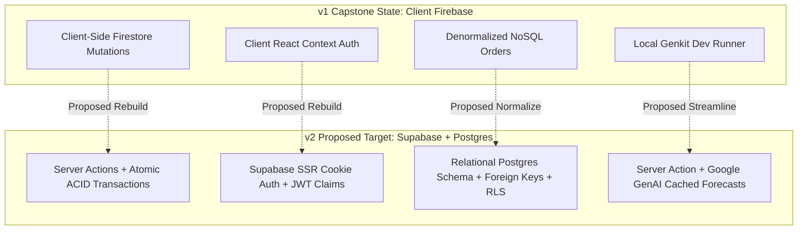
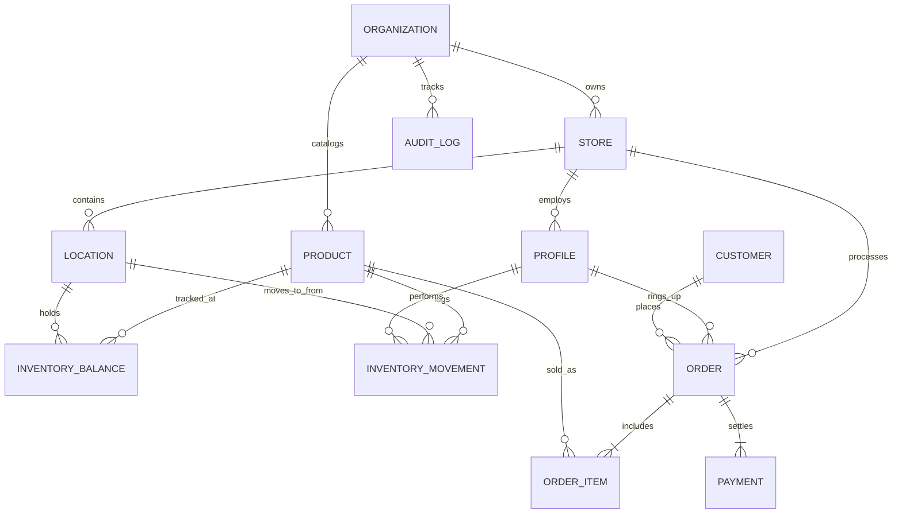

# Task 7 — InvenQrise v2: Product, Domain & Architecture Handoff

**Project Name:** InvenQrise (AI-Powered Multi-Location Supermarket Inventory & POS SaaS)  
**Status:** **PLANNED / EXPLORING (Architecture Proposed — Requires Architecture Gate Review)**  
**Target Repository:** `https://github.com/pratikk121/InvenQrise`  
**Live Demo:** `https://inven-qrise.vercel.app/`  
**Date:** August 26, 2026  

---

## 1. Origin & Background
InvenQrise represents founder **Pratik Kadole's** first serious complete software project. Originally conceived and built as a minimum viable final-year capstone project, it proved the commercial viability of integrating dual-warehouse stock management (front-of-house vs. back-of-house), camera QR code scanning for stock-in & cashier checkout, and Google GenAI Gemini predictive sales forecasting.

---

## 2. Why Task 7 Was Created
During the Task 6 GitHub portfolio audit, InvenQrise scored the highest technical and business value (95.5/100) among all evaluated repositories. However, its original v1 backend relied on client-heavy Firebase NoSQL calls without ACID transactional guarantees across multi-terminal checkouts. 

Recognizing that InvenQrise is a multi-month engineering asset and a core product candidate for Devlogic Systems, it was formally separated from the GitHub portfolio migration workstream (Task 6) into its own dedicated initiative: **Task 7 — InvenQrise v2**.

---

## 3. Current v1 State & Forensic Audit Findings



### Forensic Findings Summary:
* **Architecture:** Next.js (App Router, Turbopack), Tailwind CSS, shadcn/ui, Firebase Client SDK (Auth, Firestore, Storage), Genkit AI (`@genkit-ai/googleai`).
* **Strengths:** High UI polish, responsive POS layout, working WebRTC camera QR scanner, intuitive dual-warehouse domain model.
* **Production Readiness Score:** **`77.7 / 100`** (Frontend is production-grade; backend and data integrity layer require modernization to reach enterprise standards).

### Key v1 Security & Technical Debt Findings:
1. **HIGH Severity (Concurrency Risk):** Stock decrement occurs via client-side Firestore SDK, creating race conditions under concurrent checkouts.
2. **MEDIUM Severity (Auth Flash):** Role verification occurs in client React context, causing brief visual flash before redirects.
3. **MEDIUM Severity (AI Dev Server):** Genkit flow runner was configured for local development (`src/ai/dev.ts`) rather than a serverless edge endpoint.

---

## 4. Current Strategic Direction (PROPOSED / UNDER REVIEW)

> [!IMPORTANT]
> The following architectural direction is **PROPOSED** and subject to the upcoming Architecture Gate Review. It is not locked.

* **Target Architecture:** Clean Architectural Rebuild (Backend & Data Layer) + Refactor (Frontend UI Layer).
* **Database & Auth:** Supabase PostgreSQL with Row Level Security (RLS) + Supabase SSR Cookie Auth.
* **Transactions:** Single atomic PostgreSQL Stored Procedure / RPC (`process_pos_sale`) executing cart validation, order creation, payment recording, and double-entry stock decrement within one ACID transaction.
* **AI Integration:** Decoupled Google GenAI Gemini 1.5 Flash executed via Next.js Server Actions with daily cached projections.

---

## 5. Task 6 $\rightarrow$ Task 7 Decision History
1. **Task 6 Initial Scope:** Began as a read-only audit to consolidate GitHub repositories into `pratikk121`.
2. **InvenQrise Discovery:** Audited under Task 6.5; achieved highest score (95.5/100) and replaced `CRM` as #1 Flagship Pinned repo.
3. **Forensic Audit (Task 6.6):** Uncovered v1 Firebase limitations; proposed modern Supabase/PostgreSQL rebuild.
4. **Domain Architecture (Task 6.7):** Mapped full relational domain model, dual-layer inventory ledger, and POS state machines.
5. **Workstream Separation:** Recognized that InvenQrise v2 is an independent multi-phase product roadmap, resulting in the creation of **Task 7**.

---

## 6. Proposed Database ERD & Relational Schema (PROPOSED — NOT LOCKED)



#### Proposed PostgreSQL DDL Architecture:
```sql
-- 1. Profiles & RBAC
CREATE TABLE public.profiles (
    id UUID PRIMARY KEY REFERENCES auth.users(id) ON DELETE CASCADE,
    email TEXT NOT NULL,
    full_name TEXT NOT NULL,
    role TEXT NOT NULL CHECK (role IN ('owner', 'admin', 'cashier', 'staff')),
    created_at TIMESTAMPTZ DEFAULT now() NOT NULL
);

-- 2. Organizations & Stores
CREATE TABLE public.organizations (
    id UUID PRIMARY KEY DEFAULT gen_random_uuid(),
    name TEXT NOT NULL,
    created_at TIMESTAMPTZ DEFAULT now() NOT NULL
);

CREATE TABLE public.stores (
    id UUID PRIMARY KEY DEFAULT gen_random_uuid(),
    organization_id UUID NOT NULL REFERENCES public.organizations(id) ON DELETE CASCADE,
    name TEXT NOT NULL,
    address TEXT,
    created_at TIMESTAMPTZ DEFAULT now() NOT NULL
);

CREATE TABLE public.locations (
    id UUID PRIMARY KEY DEFAULT gen_random_uuid(),
    store_id UUID NOT NULL REFERENCES public.stores(id) ON DELETE CASCADE,
    name TEXT NOT NULL, -- e.g. 'Main Warehouse', 'Store Floor'
    created_at TIMESTAMPTZ DEFAULT now() NOT NULL
);

-- 3. Product Catalog
CREATE TABLE public.products (
    id UUID PRIMARY KEY DEFAULT gen_random_uuid(),
    organization_id UUID NOT NULL REFERENCES public.organizations(id) ON DELETE CASCADE,
    sku TEXT NOT NULL UNIQUE,
    barcode TEXT UNIQUE,
    name TEXT NOT NULL,
    category TEXT,
    price NUMERIC(10, 2) NOT NULL,
    cost_price NUMERIC(10, 2) DEFAULT 0.00,
    low_stock_threshold INT NOT NULL DEFAULT 5,
    image_url TEXT,
    created_at TIMESTAMPTZ DEFAULT now() NOT NULL
);

-- 4. Double-Entry Inventory Balances & Movement Ledger
CREATE TABLE public.inventory_balances (
    id UUID PRIMARY KEY DEFAULT gen_random_uuid(),
    product_id UUID NOT NULL REFERENCES public.products(id) ON DELETE CASCADE,
    location_id UUID NOT NULL REFERENCES public.locations(id) ON DELETE CASCADE,
    quantity_on_hand INT NOT NULL DEFAULT 0,
    UNIQUE(product_id, location_id)
);

CREATE TABLE public.inventory_movements (
    id UUID PRIMARY KEY DEFAULT gen_random_uuid(),
    product_id UUID NOT NULL REFERENCES public.products(id),
    from_location_id UUID REFERENCES public.locations(id),
    to_location_id UUID REFERENCES public.locations(id),
    quantity INT NOT NULL,
    movement_type TEXT NOT NULL CHECK (movement_type IN ('STOCK_IN', 'TRANSFER', 'SALE', 'ADJUSTMENT', 'RETURN')),
    performed_by UUID REFERENCES public.profiles(id),
    notes TEXT,
    created_at TIMESTAMPTZ DEFAULT now() NOT NULL
);

-- 5. Orders & Transactions
CREATE TABLE public.orders (
    id UUID PRIMARY KEY DEFAULT gen_random_uuid(),
    store_id UUID NOT NULL REFERENCES public.stores(id),
    cashier_id UUID REFERENCES public.profiles(id),
    subtotal NUMERIC(10, 2) NOT NULL,
    tax NUMERIC(10, 2) DEFAULT 0.00,
    total NUMERIC(10, 2) NOT NULL,
    payment_method TEXT NOT NULL CHECK (payment_method IN ('cash', 'card', 'upi')),
    status TEXT NOT NULL DEFAULT 'completed',
    created_at TIMESTAMPTZ DEFAULT now() NOT NULL
);

CREATE TABLE public.order_items (
    id UUID PRIMARY KEY DEFAULT gen_random_uuid(),
    order_id UUID NOT NULL REFERENCES public.orders(id) ON DELETE CASCADE,
    product_id UUID NOT NULL REFERENCES public.products(id),
    quantity INT NOT NULL CHECK (quantity > 0),
    unit_price NUMERIC(10, 2) NOT NULL,
    total_price NUMERIC(10, 2) NOT NULL
);
```

---

## 7. Proposed Architectural Decision Records (ADRs)

> [!NOTE]
> All ADRs below are marked **PROPOSED / REQUIRES ARCHITECTURE GATE REVIEW**.

* **ADR-001: Database Engine** $\rightarrow$ PostgreSQL (via Supabase) for ACID transactions & RLS.
* **ADR-002: Authentication** $\rightarrow$ Supabase SSR Auth with HTTP-only cookies in Next.js Middleware.
* **ADR-003: Inventory Model** $\rightarrow$ Dual-layer model (Immutable `inventory_movements` ledger + materialized `inventory_balances` table).
* **ADR-004: POS Transactions** $\rightarrow$ Single atomic stored procedure / RPC (`process_pos_sale`).
* **ADR-005: Multi-Tenancy** $\rightarrow$ Shared Database with `organization_id` column and Row Level Security.
* **ADR-006: AI Decoupling** $\rightarrow$ Asynchronous Server Actions with Daily Projection Cache.

---

## 8. Open Questions for Task 7
1. Should InvenQrise v2 be initialized in a fresh repository (`pratikk121/invenqrise-v2` or branch `v2-main`) to keep git history pristine?
2. Should thermal receipt printer ESC/POS support be added in Phase 2 or deferred to future scope?
3. Should barcode generation support standard EAN-13 / Code-128 alongside QR codes?

---

## 9. Next Steps for Task 7
* **Next Immediate Activity:** **Task 7.1 — Architecture Gate Review & Repository Strategy Alignment**.  
*(Do not execute code or create database resources until officially scheduled).*
