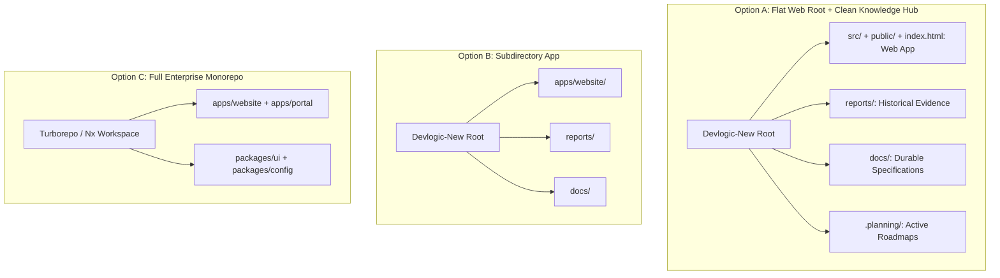
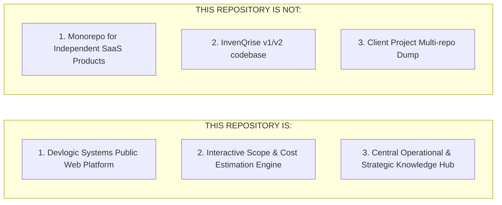

# DEVLOGIC SYSTEMS — REPOSITORY STRUCTURE & ARCHITECTURE AUDIT

**Target Repository:** `https://github.com/pratikk121/Devlogic-New`  
**Scope:** Repository Architecture, Operational Hub Boundary, Directory Structure & Dependency Analysis  
**Mode:** READ-ONLY ARCHITECTURAL AUDIT  
**Status:** COMPLETE & PROPOSED  
**Date:** August 26, 2026  

---

## 1. Executive Summary

This architecture audit evaluates the directory structure and operational boundaries of the `Devlogic-New` repository. Originally created as the frontend website for Devlogic Systems, the repository has expanded to house planning artifacts, design directives, task audits, and strategic roadmaps. 

This audit analyzes whether the repository should transition to a subdirectory model (`apps/website`), a full monorepo, or retain its flat root structure with organized documentation and tooling directories.

---

## 2. Current Structure Audit & File Classification

| Item | Type | Category | Role / Purpose |
| :--- | :---: | :--- | :--- |
| **`src/`** | Directory | **Application Source** | Core React 19 + TypeScript application source code (`App.tsx`, `components/`, `data/`, `index.css`, `types.ts`). |
| **`public/`** | Directory | **Static Asset** | Public web assets served at root (`favicon.svg`, `logo*.svg`, `robots.txt`, `sitemap.xml`). |
| **`index.html`** | File | **Project Configuration / Entry** | SPA entry point; contains SEO meta tags, Google Fonts, and module script pointing to `/src/main.tsx`. |
| **`package.json` & `package-lock.json`** | Files | **Project Configuration** | NPM dependency definitions, scripts (`dev`, `build`, `preview`, `lint`), and version locks. |
| **`vite.config.ts`** | File | **Project Configuration** | Vite 6 bundler config, React plugin, Tailwind CSS v4 integration, and `@` path alias (`.`). |
| **`tsconfig.json`** | File | **Project Configuration** | TypeScript compiler options, JSX transform, DOM libs, and path mapping (`@/* -> ./*`). |
| **`.gitignore`** | File | **Project Configuration** | Git ignore rules for node_modules, build outputs, environment files, and local logs. |
| **`.env.example`** | File | **Project Configuration** | Template for Gemini API and environment variables. |
| **`metadata.json`** | File | **Tooling / Metadata** | AI Studio workspace configuration metadata and capabilities declaration. |
| **`reports/`** | Directory | **Audit / Historical Report** | Multi-day audit records (`DAY 1/`, `DAY 2/`, `future/`). |
| **`.planning/`** | Directory | **Planning / Intel** | GSD planning artifacts (`.planning/codebase/`). |
| **`.agent/`** | Directory | **Agent / Tooling Config** | Workspace workflows (`.agent/workflows/`). |
| **`assets/`** | Directory | **Tooling / Staging Asset** | AI Studio metadata/staging directory (`assets/.aistudio/`). |
| **`node_modules/`** | Directory | **Dependency / Generated** | Local npm dependencies (git-ignored). |
| **`dist/`** | Directory | **Build Artifact** | Production build output directory (git-ignored). |
| **`lighthouse-report.json`** | File | **Audit Artifact / Generated** | 791 KB historical Lighthouse audit output (git-ignored). |
| **`dark_mode_prompts.md`** | File | **Design / Prompt** | Scratch design prompts for dark mode theming. |
| **`redesign_prompts.md`** | File | **Design / Prompt** | Scratch design prompts for UI components. |

---

## 3. Dependency & Path Coupling Analysis

1. **Vite Root & Entry Point:**
   * `index.html` contains `<script type="module" src="/src/main.tsx"></script>`.
   * Vite by default treats the directory containing `index.html` as the project root. Moving `src/` into a nested subdirectory requires moving `index.html` or explicitly defining `root: 'apps/website'` in `vite.config.ts`.
2. **TypeScript Path Aliases (`tsconfig.json` & `vite.config.ts`):**
   * `tsconfig.json` defines `"@/*": ["./*"]`.
   * `vite.config.ts` defines `alias: { '@': path.resolve(__dirname, '.') }`.
   * All internal imports across components and data files currently resolve from the root level.
3. **Public Directory Assets:**
   * Vite serves static files from `public/` directly at `/` (e.g. `/favicon.svg`, `/sitemap.xml`, `/robots.txt`).
   * Nested subdirectory refactoring would require explicit `publicDir` configuration.
4. **Tailwind CSS v4 Integration:**
   * `@tailwindcss/vite` dynamically scans files based on Vite's module graph starting from `index.html` and `src/index.css`. Keeping `src/` at the root guarantees seamless style generation without path re-configuration.

---

## 4. Production Deployment Analysis

* **Hosting Platform:** Vercel Edge / Static Hosting (`https://devlogicsystems.in`).
* **Root Directory Setting:** Vercel's default is `Root Directory: .` (repository root).
* **Build Command:** `npm run build` $\rightarrow$ executes `vite build` $\rightarrow$ outputs to `./dist`.
* **Subdirectory Impact:** If the website source were moved into `apps/website`, Vercel's Project Settings $\rightarrow$ General $\rightarrow$ **Root Directory** would have to be changed to `apps/website`, or a custom `vercel.json` with build overrides would be required.

---

## 5. Architectural Structure Options



### Comparative Evaluation

| Dimension | Option A: Flat Web Root (Recommended) | Option B: Subdirectory (`apps/website`) | Option C: Monorepo (`apps/` + `packages/`) |
| :--- | :---: | :---: | :---: |
| **Complexity** | **Very Low** | Moderate | High |
| **Vercel Migration Risk** | **Zero (No config changes)** | High (Requires root directory update) | High (Requires Turborepo pipeline) |
| **Vite Compatibility** | **Native (100% Out of box)** | Requires path remapping | Requires workspace aliases |
| **Current Maintainability** | **Extremely Clean & Scannable** | Nested overhead for a single app | Heavy boilerplate overhead |
| **Suitability for Current Stage** | **Ideal (Right-sized for current phase)** | Premature abstraction | Substantially premature |
| **Evolution Path** | Cleanly transitions to monorepo when internal packages exist | Step towards monorepo | End state |

---

## 6. Architectural Recommendation

### 🎯 **Recommendation: OPTION A (Flat Web Root + Clean Operational Knowledge Hub)**

#### Rationale:
1. **Zero Deployment & Build Fragility:** Leaves the production build path (`index.html` $\rightarrow$ `src/` $\rightarrow$ `dist/`) completely untouched and rock-solid.
2. **Clean Separation of Concerns:** The repository functions simultaneously as the live Devlogic Systems web application AND its operational/design intelligence hub by cleanly sequestering documentation into `reports/`, `docs/`, and `.planning/`.
3. **No Premature Abstraction:** There are no other applications or shared UI packages in this repository (InvenQrise, Swara PG, and Seed PWA are independent repositories). Creating an `apps/` directory for 1 single app adds unnecessary friction.

---

## 7. Root Directory Policy

### ✅ Permitted at Repository Root:
* **Application Core:** `src/`, `public/`, `index.html`
* **Configuration Files:** `package.json`, `package-lock.json`, `vite.config.ts`, `tsconfig.json`, `.gitignore`, `.env.example`, `metadata.json`
* **Documentation & Operations:** `README.md`, `reports/`, `docs/`, `prompts/`
* **Tooling & Agent System:** `.agent/`, `.planning/`, `.git/`

### ❌ Prohibited at Repository Root:
* Temporary benchmark/audit dumps (e.g. `lighthouse-report.json` $\rightarrow$ `.gitignore` or `reports/`)
* Scratch design prompt markdown files (e.g. `*_prompts.md` $\rightarrow$ `prompts/`)
* Ephemeral build artifacts (`dist/`, `build/`, `server.js`)
* Temporary screenshots or media dumps

---

## 8. Documentation Architecture

```
Devlogic-New/
├── docs/                        # Durable Architectural Knowledge & Specifications
│   ├── ARCHITECTURE.md          # Web design tokens, components, and telemetry engine
│   └── BRAND_GUIDELINES.md      # Typography, color tokens, and messaging standards
│
├── reports/                     # Historical Evidence & Time-Stamped Task Audits
│   ├── DAY 1/                   # Day 1 Production & SEO audits
│   ├── DAY 2/                   # Day 2 Founder Trust, Task 6 GitHub, Task 7 Handoff
│   ├── future/                  # Future roadmaps and strategic plans
│   └── DEVLOGIC_NEW_REPOSITORY_STRUCTURE_ARCHITECTURE_AUDIT.md # This audit
│
└── prompts/                     # Reusable Design & Engineering Prompts
    ├── dark_mode_prompts.md     # Dark mode CSS token prompts
    └── redesign_prompts.md      # UI & layout engineering prompts
```

* **`docs/`:** Durable architectural and brand specifications.
* **`reports/`:** Historical audit snapshots, security verifications, and milestone logs.
* **`prompts/`:** Reusable agent prompts, UI design directives, and AI templates.

---

## 9. Agent & Planning Architecture

* **`.agent/`:** Workspace workflows (e.g. `.agent/workflows/audit.md`, `polish.md`). Remains at root as a hidden dot-folder per standard IDE/agent tooling conventions.
* **`.planning/`:** Codebase intelligence and phase planning (e.g. `.planning/codebase/`). Remains at root as a hidden dot-folder so it does not clutter developer directory browsing.

---

## 10. Generated File Policy

| File / Folder | Action | Rationale |
| :--- | :---: | :--- |
| **`node_modules/`** | **IGNORE** | Managed by npm; ignored in `.gitignore`. |
| **`dist/`** | **IGNORE** | Ephemeral Vite build output; ignored in `.gitignore`. |
| **`lighthouse-report.json`** | **IGNORE / ARCHIVE** | 791 KB transient test dump. Add to `.gitignore` and do not track in source control. |
| **`dark_mode_prompts.md`** | **MOVE** | Move into `prompts/` directory to keep root clean. |
| **`redesign_prompts.md`** | **MOVE** | Move into `prompts/` directory to keep root clean. |

---

## 11. Devlogic-New Repository Boundary



* **THIS REPOSITORY IS:**
  * The production web platform and primary digital identity for Devlogic Systems (`https://devlogicsystems.in`).
  * The central design system, interactive scope estimator, and public case studies engine.
  * The operational documentation and strategic roadmap hub for Devlogic Systems.
* **THIS REPOSITORY IS NOT:**
  * A company monorepo containing standalone products (`InvenQrise`, `Swara_and_saumya_pg`, `seed-monitoring-pwa`, `CRM` remain independent standalone repositories).
  * A dumping ground for external client code or transient scratch experiments.

---

## 12. Migration Map (Proposed Future Organization)

| Current Location | Proposed Location | Action | Impact on Build / Vercel |
| :--- | :--- | :---: | :--- |
| `dark_mode_prompts.md` | `prompts/dark_mode_prompts.md` | Move | **None (Zero risk)** |
| `redesign_prompts.md` | `prompts/redesign_prompts.md` | Move | **None (Zero risk)** |
| `lighthouse-report.json` | (Deleted / Ignored) | Untrack | **None (Zero risk)** |
| `src/`, `public/`, `index.html` | Retained at Root | Keep | **None (100% Stable)** |
| `reports/` | Retained at Root | Keep | **None (100% Stable)** |

---

## 13. Impact on Task 6.8 & Sequencing

* **Execution Order:** Execute minor repository file moves (`prompts/` and `.gitignore`) **AFTER Task 6.8 Profile README is completed** (as a dedicated Task 6.9 cleanup step).
* **Rationale:** Keeps Task 6 focused on public founder branding and profile establishment without introducing unnecessary repo changes.
