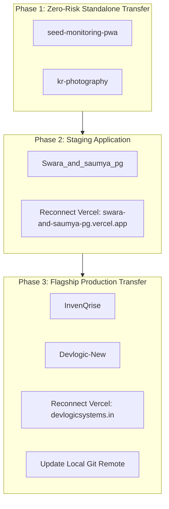

# DEVLOGIC SYSTEMS — FUTURE ROADMAP & STRATEGIC EXECUTION PLANS

This directory serves as the centralized repository for all strategic initiatives, architectural specifications, technical blueprints, and operational steps scheduled for future execution across Devlogic Systems and founder portfolios.

---

## 📑 INDEX OF FUTURE INITIATIVES & WORKSTREAMS

| Initiative | Task ID | Category | Target Milestone | Status | Key Specification |
| :--- | :---: | :--- | :---: | :---: | :--- |
| **GitHub Portfolio Consolidation** | **Task 6** | Technical Identity | Day 3–7 | **IN PROGRESS** | Migrate repositories to `pratikk121`; pin 4 Flagships. |
| **InvenQrise v2 Rebuild & SaaS** | **Task 7** | Core Product / ERP | Day 15–45 | **PLANNED / EXPLORING** | Architecture proposed; awaiting Architecture Gate Review. |
| **Devlogic Case Study Modals** | Task 8 | Website UX | Day 7–14 | **PLANNED** | Deep-dive modals for InvenQrise, Swara PG, Seed PWA. |
| **Devlogic Micro-Packages** | Task 9 | Open Source | Day 30–60 | **PLANNED** | Extract `@devlogic/scope-estimator`, telemetry canvas engine. |

---

## 1. TASK 6 — GITHUB REPOSITORY CONSOLIDATION EXECUTION PLAN



### Step-by-Step Migration Execution:
1. **Transfer `seed-monitoring-pwa`:** `novaninja1512-sketch` $\rightarrow$ `pratikk121`.
2. **Transfer `kr-photography`:** `novaninja1512-sketch` $\rightarrow$ `pratikk121`.
3. **Transfer `Swara_and_saumya_pg`:** `novaninja1512-sketch` $\rightarrow$ `pratikk121` + Reconnect Vercel Git integration.
4. **Transfer `InvenQrise`:** `invenqrise-creator` $\rightarrow$ `pratikk121` + Reconnect Vercel Git integration (`inven-qrise.vercel.app`).
5. **Transfer `Devlogic-New`:** `novaninja1512-sketch` $\rightarrow$ `pratikk121` + Reconnect Vercel Git integration (`devlogicsystems.in`) + Update local git remote:
   ```bash
   git remote set-url origin https://github.com/pratikk121/Devlogic-New.git
   ```

---

## 2. FOUNDER GITHUB PROFILE SPECIFICATION (`pratikk121/pratikk121`)

* **Repository:** `https://github.com/pratikk121/pratikk121`
* **Bio:** `Founder & Lead Systems Architect @ Devlogic Systems | Building high-reliability web apps, ERPs & automation.`
* **Website:** `https://devlogicsystems.in`
* **LinkedIn:** `https://www.linkedin.com/in/pratik-kadole-119391267/`

### The 4 Flagship Pinned Projects:
1. **`InvenQrise` (95.5/100):** *AI-Powered Supermarket Inventory & Point-of-Sale ERP (Next.js + Genkit + Firestore / Supabase).*
2. **`Devlogic-New` (94.0/100):** *Production TypeScript web architecture for Devlogic Systems.*
3. **`Swara_and_saumya_pg` (86.0/100):** *Commercial operations portal & tenant management system.*
4. **`seed-monitoring-pwa` (84.0/100):** *Offline-first field telemetry PWA with real-time sensor metrics.*

---

## 3. TASK 7 — INVENQRISE V2 ARCHITECTURAL REBUILD BLUEPRINT (PROPOSED)

* **Goal:** Rebuild InvenQrise v1 into a production-grade, multi-location inventory and POS SaaS.
* **Status:** **PLANNED / EXPLORING (Awaiting Architecture Gate Review)**
* **Target Stack (Proposed):**
  * **Framework:** Next.js 15 (App Router + Server Actions)
  * **Database:** Supabase PostgreSQL (Row Level Security + ACID Transactions)
  * **Authentication:** Supabase Auth (SSR Cookie Middleware + Custom JWT Claims)
  * **Storage:** Supabase Storage (`product-images` bucket with WebP compression)
  * **AI Engine:** Google GenAI Gemini 1.5 Flash (Asynchronous cached 30-day projections)

### Target PostgreSQL Relational Schema (Proposed):
```sql
-- 1. Profiles & RBAC
CREATE TABLE public.profiles (
    id UUID PRIMARY KEY REFERENCES auth.users(id) ON DELETE CASCADE,
    email TEXT NOT NULL,
    full_name TEXT NOT NULL,
    role TEXT NOT NULL CHECK (role IN ('owner', 'admin', 'cashier', 'staff')),
    created_at TIMESTAMPTZ DEFAULT now() NOT NULL
);

-- 2. Organizations & Stores
CREATE TABLE public.organizations (
    id UUID PRIMARY KEY DEFAULT gen_random_uuid(),
    name TEXT NOT NULL,
    created_at TIMESTAMPTZ DEFAULT now() NOT NULL
);

CREATE TABLE public.stores (
    id UUID PRIMARY KEY DEFAULT gen_random_uuid(),
    organization_id UUID NOT NULL REFERENCES public.organizations(id) ON DELETE CASCADE,
    name TEXT NOT NULL,
    address TEXT,
    created_at TIMESTAMPTZ DEFAULT now() NOT NULL
);

CREATE TABLE public.locations (
    id UUID PRIMARY KEY DEFAULT gen_random_uuid(),
    store_id UUID NOT NULL REFERENCES public.stores(id) ON DELETE CASCADE,
    name TEXT NOT NULL, -- e.g. 'Main Warehouse', 'Store Floor'
    created_at TIMESTAMPTZ DEFAULT now() NOT NULL
);

-- 3. Product Catalog
CREATE TABLE public.products (
    id UUID PRIMARY KEY DEFAULT gen_random_uuid(),
    organization_id UUID NOT NULL REFERENCES public.organizations(id) ON DELETE CASCADE,
    sku TEXT NOT NULL UNIQUE,
    barcode TEXT UNIQUE,
    name TEXT NOT NULL,
    category TEXT,
    price NUMERIC(10, 2) NOT NULL,
    cost_price NUMERIC(10, 2) DEFAULT 0.00,
    low_stock_threshold INT NOT NULL DEFAULT 5,
    image_url TEXT,
    created_at TIMESTAMPTZ DEFAULT now() NOT NULL
);

-- 4. Double-Entry Inventory Balances & Movement Ledger
CREATE TABLE public.inventory_balances (
    id UUID PRIMARY KEY DEFAULT gen_random_uuid(),
    product_id UUID NOT NULL REFERENCES public.products(id) ON DELETE CASCADE,
    location_id UUID NOT NULL REFERENCES public.locations(id) ON DELETE CASCADE,
    quantity_on_hand INT NOT NULL DEFAULT 0,
    UNIQUE(product_id, location_id)
);

CREATE TABLE public.inventory_movements (
    id UUID PRIMARY KEY DEFAULT gen_random_uuid(),
    product_id UUID NOT NULL REFERENCES public.products(id),
    from_location_id UUID REFERENCES public.locations(id),
    to_location_id UUID REFERENCES public.locations(id),
    quantity INT NOT NULL,
    movement_type TEXT NOT NULL CHECK (movement_type IN ('STOCK_IN', 'TRANSFER', 'SALE', 'ADJUSTMENT', 'RETURN')),
    performed_by UUID REFERENCES public.profiles(id),
    notes TEXT,
    created_at TIMESTAMPTZ DEFAULT now() NOT NULL
);

-- 5. Orders & Transactions
CREATE TABLE public.orders (
    id UUID PRIMARY KEY DEFAULT gen_random_uuid(),
    store_id UUID NOT NULL REFERENCES public.stores(id),
    cashier_id UUID REFERENCES public.profiles(id),
    subtotal NUMERIC(10, 2) NOT NULL,
    tax NUMERIC(10, 2) DEFAULT 0.00,
    total NUMERIC(10, 2) NOT NULL,
    payment_method TEXT NOT NULL CHECK (payment_method IN ('cash', 'card', 'upi')),
    status TEXT NOT NULL DEFAULT 'completed',
    created_at TIMESTAMPTZ DEFAULT now() NOT NULL
);

CREATE TABLE public.order_items (
    id UUID PRIMARY KEY DEFAULT gen_random_uuid(),
    order_id UUID NOT NULL REFERENCES public.orders(id) ON DELETE CASCADE,
    product_id UUID NOT NULL REFERENCES public.products(id),
    quantity INT NOT NULL CHECK (quantity > 0),
    unit_price NUMERIC(10, 2) NOT NULL,
    total_price NUMERIC(10, 2) NOT NULL
);
```

---

## 4. 90-DAY DEVLOGIC TECHNICAL EVOLUTION ROADMAP

```
MONTH 1: FOUNDATION & CONSOLIDATION
• Execute Task 6 GitHub repository migration to pratikk121.
• Set up pratikk121/pratikk121 profile README.
• Complete Case Study interactive modals on devlogicsystems.in.

MONTH 2: INVENQRISE V2 REBUILD (TASK 7)
• Complete Architecture Gate Review for Task 7.
• Initialize Next.js 15 + Supabase PostgreSQL repository for InvenQrise v2.
• Implement atomic POS checkout stored procedures and camera QR scanner stream.
• Wire Google GenAI Gemini 30-day cached sales forecasting.

MONTH 3: OPEN-SOURCE UTILITIES & SCALING
• Extract standalone open-source npm packages:
  - @devlogic/scope-estimator (Interactive estimation math engine)
  - @devlogic/telemetry-canvas (High-performance telemetry particle canvas)
• Publish technical engineering articles & live interactive architecture demos.
```
